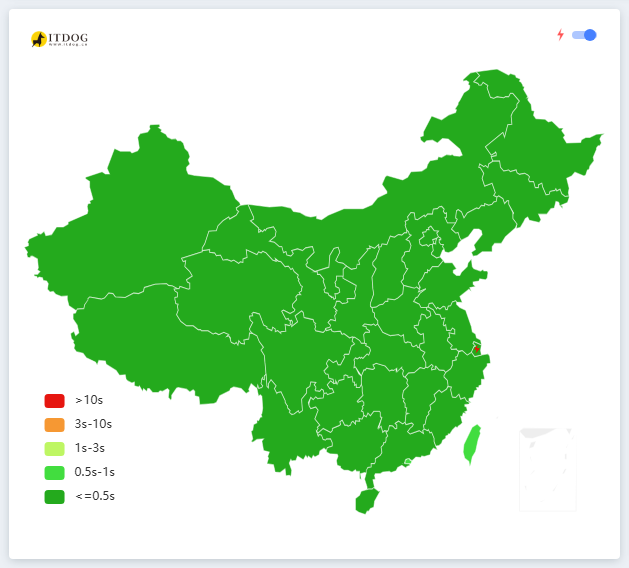
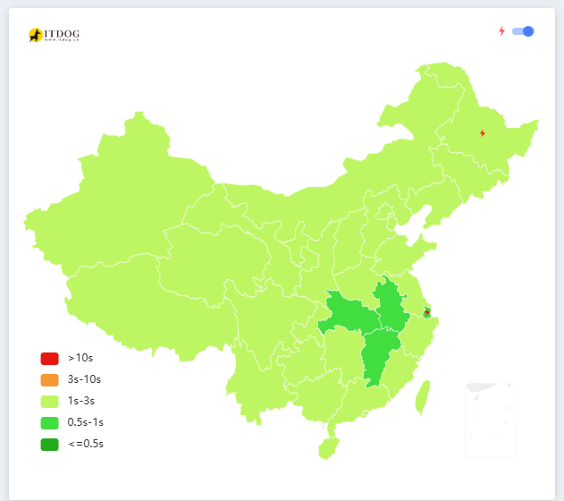
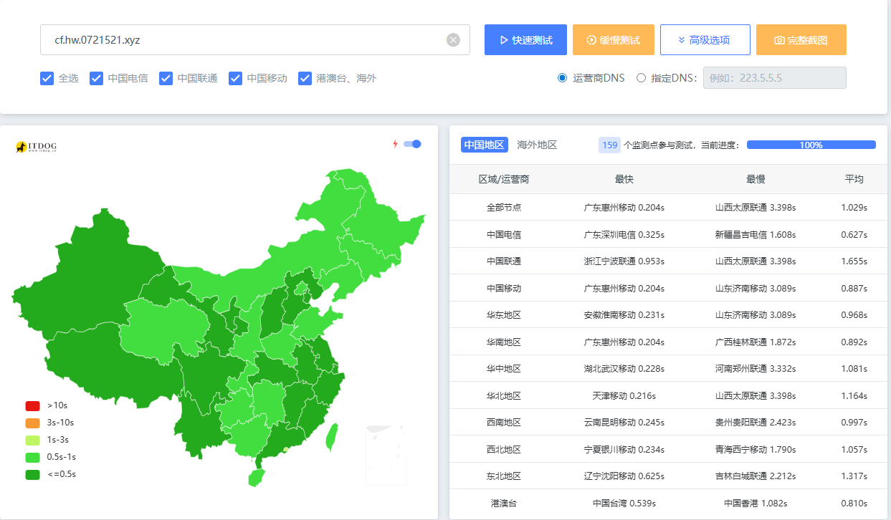
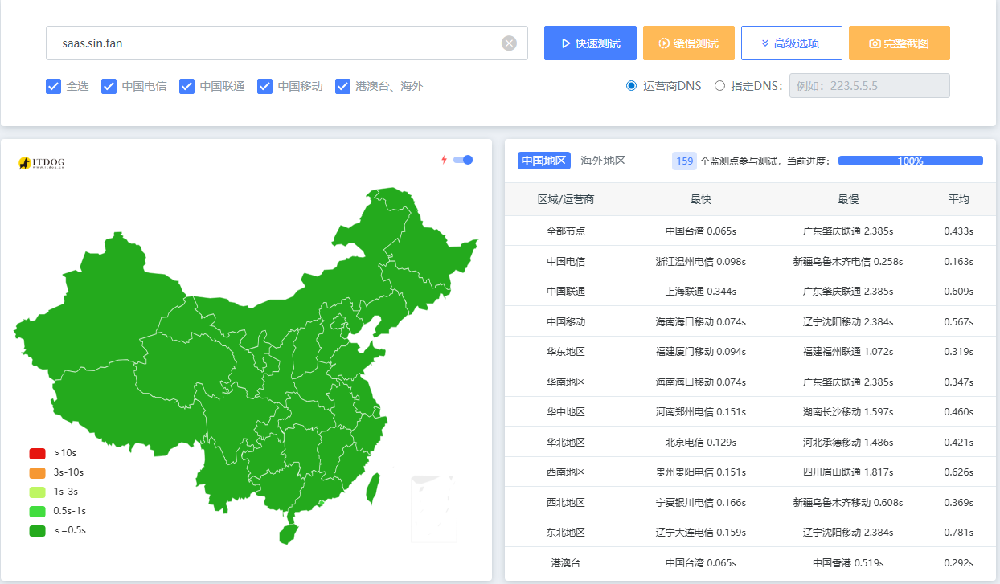

# `#`（1）EMBY反代合集（他人维护）
> `使用方法：反代头/emby域名`+通常端口为443

```bash
- https://ada.6yhy.top/
- https://fd.dirige.de5.net/
- https://auto.embys.dpdns.org/
- https://auto.liuer.indevs.in/
- https://auto.dolby.dpdns.org/
- https://assrt.net/
```

---

# `#`（2）优选域名

- ## CM大佬维护：
> 
> https://cf.090227.xyz/

- ## 秋名山大佬维护：
> 
> https://cf.877774.xyz/

- ## 自用hw云单ipvv4优选（ipv6屏蔽不通）
> 
> https://cf.hw.0721521.xyz

- ## 优选域（saas.sin.fan）
> 
> https://saas.sin.fan

---


# ` ——自此本章完结——`
