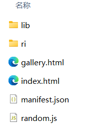
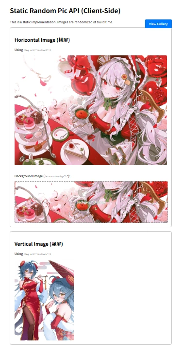

---
title: Static.Random.PicAPI的随机图 Gallery的样式性能优化
published: 2026-01-27T14:43:00
description: Fork 随机图库项目后，仓库项目似乎还没更新。于是照葫芦画瓢搓了 gallery的（sticky 顶栏、日夜模式、占位防跳动、触底分批加载逻辑），并把部署步骤交给到给你。
image: ../assets/blogimg/1769493025215.webp
tags:
  - 项目优化
draft: false
lang: ""
---

> 说明：本文基于原作者项目进行二次优化与记录，感谢原作者的思路与代码。本文仅用于学习与个人使用，转载请注明来源。

## 1) 背景：SRPAPI这个项目原本能做什么？？

这是一个「静态随机图库」项目，构建后输出 `dist/`,静态托管即可：

- 首页展示随机图片
- `gallery.html` 展示图库
- 横图/竖图分类（H/V）

但原版的 `gallery.html` 有两个明显问题：

1. 一次性加载太多图片，浏览器会卡
2. 页面样式不够顺眼（布局、交互、日夜模式等）

## 2) 作者的api是完善过了，但仓库项目似乎还没有更新。
>> 原作者的[API](https://pic1.acofork.com): https://pic1.acofork.com

- 干脆直接自己找ai搓来玩，因此把给它“*Transform*”了吧，其实也是造**葫芦画瓢**，也没啥说法就是了。

---

## 3) 至于画瓢画了哪些东西呢？如下：

### 1. Gallery 样式升级
- 顶栏改为 **sticky + 玻璃拟态**
- 横/竖切换更明显
- 标题更大、更醒目
- Hover 放大动效

### 2. 性能优化
- **触底自动加载**，每批 20 张
- 图片加载时使用 **占位容器**，防止跳动

### 3. 体验细节
- **日/夜模式切换**
- 点击图片可进入预览（lightbox）。直接套用Fancybox组件了，简单直接又省心。

---

## 4) 操作过程


### 1.好了也是问ai将项目搓好了，虽然没做什么但是辛苦我了...玩个梗哈哈。弄好之后我们，得到了这一坨文件。
拿到文件，我们先把config.json里的域名，给他改改。改成你R2的存储公共开放域名。
图1

- 因为我弄了反代用pic和gallery去隐藏了/index.html和/gallery.html的后缀，所以我要多填两个域名,详见博客文章[link](test)。如果你们无所谓那就无所谓吧!你直接填 **你的公共域/index(gallery).html就行了**。
```bash
{
    "domain": "https://rapi.0w0.us.ci",
    "galleryDomain": "https://gallery.0w0.us.ci",  //不用反代就 公共域+/index.html
    "indexDomain": "https://pic.0w0.us.ci"         //不用反代就 公共域+/gallery.html
}
```

`注意啊，如果你按教程来，那么那个图库基本上是fork仓库原作者的图（应该有4000多张），我自己是在本地新建的ri文件存的是自己的图。是否要换用自己的图库，看你·_·自己。`
- 我自己就差不多700来张图，自己存的和一些从pixiv上爬我自己的个人收藏图。你问，这个脚本有吗？**`有的！兄弟有的 `**。你可以自己github搜索、搓一个或者我在用的这个[link](https://github.com/TyrEamon/Pixiv-mylove)


*填完，接下来我们就能本地 build 构建 dist 瞧瞧。*

### 直接命令行 `node build.js` 得到构建产物/dist。（如果你没有装过依赖，你要执行一次 `npm install`）
```bash
npm install
node build.js
```
耐心等待

如图，拿到产物。我们lib就是gallery页面相关逻辑js了，图片就存在ri里。
**给他本地预览一下**继续命令行
  ```bash
  npx serve dist
  ```
你会在终端得到 http://localhost:3000 本地预览地址,进行网页访问。


### 5) 上传部署（以 Cloudflare R2 为例）
`个人用的是rclone，不过推荐用Cyberduck，有GUI界面更直观友好。`

首先登录cloudflare获取你的：


  - *R2 的 Access Key ID*
  - *R2 的 Secret Access Key*
  - *R2 的 Endpoint（S3 兼容地址）*

- `rclone` 同步到 R2：
```bash
rclone sync "C:\Users\Tyr.Eamon\Desktop\博客背景文件\随机图\dist" r2:YOUR_BUCKET --checksum --transfers 16 --checkers 16 --progress
```
- `Cyberduck` 同步R2：
打开 *Cyberduck*
  - 选择Amazon S3协议。
  - Server（服务器）：填你的 R2 endpoint 的主机名。*形如：<accountid>.r2.cloudflarestorage.com*（不要带 https://，不要带路径）
  - Port：443
  - Access Key ID：填你的 R2 Access Key ID
  - Secret Access Key：填你的 R2 Secret Access Key


上传文件完全后，直接访问你的R2公开域就能看到SPA的界面了。
**R2公共域**
<details>
<summary>点击展开</summary>

这里默认你部署前绑好了。


</details>

**OK啊，到这里算部署出成功了，接下来就是愉快的玩耍了**
---

## 6) 最后的后面：尊重原创

- 这是 fork 项目的优化记录，不是从零开发。感谢原作者AcoFork提供的基础结构。  
- 如果你也喜欢或正在在用这个项目，可以去关注他的[二叉树树的博客](https://2x.nz)。

---
# ——自此本章完结——
