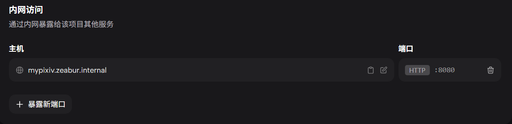
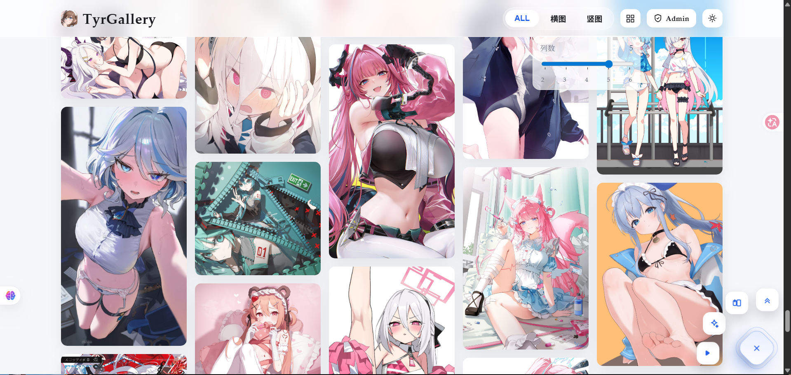
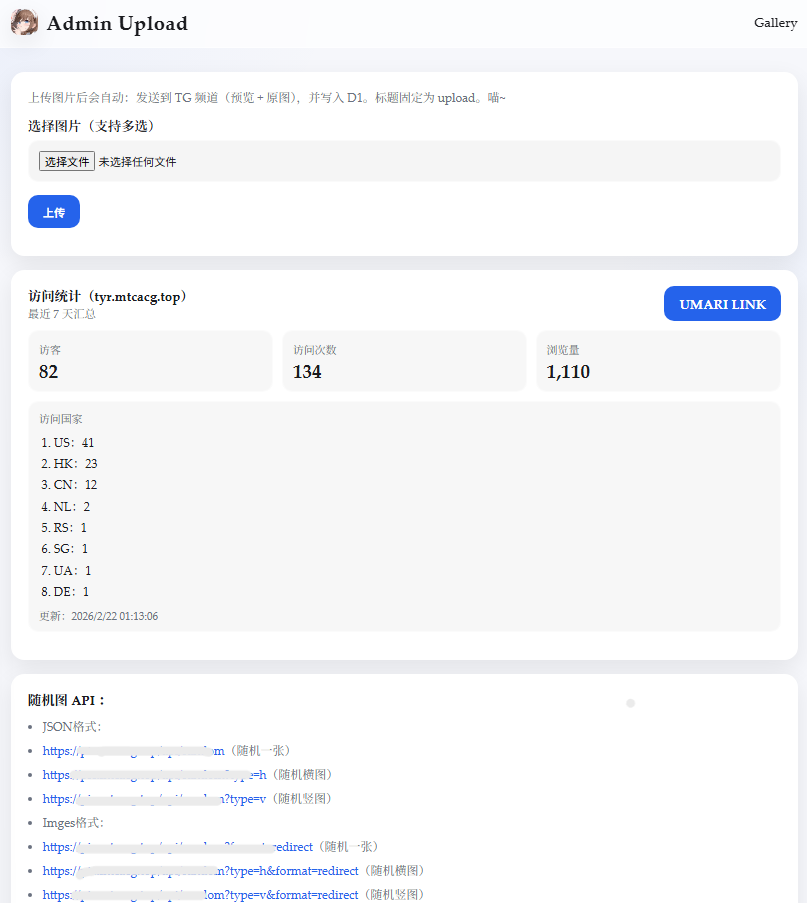
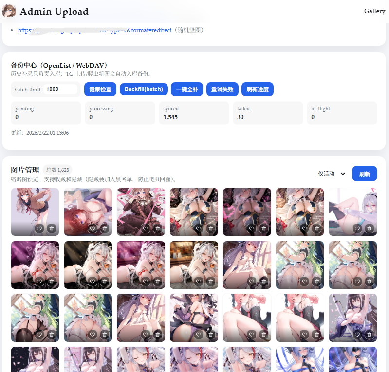

---
title: xin 项目从 0 到可用：Pixiv + Telegram + D1 图站实战（含排坑）
published: 2026-02-21T23:30:00
description: 按可复制步骤把 xin 跑起来：后端 Zeabur、前端 Pages/Edge、D1、TG 双频道、备份与常见报错定位。
image: "../assets/blogimg/前台页.png"
tags:
  - xin
  - 图站
  - Pixiv
  - Telegram
  - D1
  - Zeabur
  - 排坑
draft: false
lang: ""
---

> 这篇是给“能跑起来最重要”的同学写的。  
> 目标就三个：**照着做能成功**、**报错知道去哪看**、**看完能讲清楚为什么这么做**。

---

## 0. 先说结论：xin 到底在干嘛

`xin` 本质是一个 **Go 后端 + 静态前端** 的图站方案：

- 图来源：Pixiv 收藏爬取、TG 发图、TG 发链接（Pixiv / Yande / X / FANBOX）
- 图存储：
  - 发布频道 A：放预览图（给前台看）
  - 存储频道 B：放原图（留档 + 按钮获取）
- 元数据：Cloudflare D1
- 可选备份：WebDAV / OpenList

**关键设计**：前台只吃预览图，原图走 B 频道，前端更稳，带宽压力也更小。

> [图位 1：系统架构图（待补）]  
> 建议文件：`../assets/blogimg/xin-01-arch.png`  
> 内容建议：Pixiv/TG -> Go 后端 -> A/B 频道 + D1 + WebDAV

---

## 1. 前置条件（不满足就别往下）

先确认你有这些东西：

- 一个 Telegram Bot（拿到 `BOT_TOKEN`）
- 两个 Telegram 频道：A（发布）+ B（存储）
- （可选）A 绑定的讨论组（用于评论区挂原图/详情按钮）
- Cloudflare D1（已有数据库 ID）
- Zeabur（部署后端容器）
- Cloudflare Pages / EdgeOne（部署静态前端）

### 1.1 TG 权限

机器人必须是 A、B 两个频道管理员；要用讨论区就让机器人在讨论组也能发消息。

---

## 2. D1：先把库准备好

你有两种方式：

1. 直接跑项目里的 `schema.sql`（推荐）
2. 让后端首次启动自动补齐（更省事，但建议后面手动核对）

如果你是旧库升级，至少确认这些表存在：

- `images`
- `favorites`
- `ingest_blocklist`
- `crawler_state`
- （开备份）`image_backups`

快速检查表：

```sql
SELECT name FROM sqlite_master WHERE type='table' ORDER BY name;
```

> 

---

## 3. Zeabur 部署后端（最小可用）

### 3.1 必填环境变量

最小集合（先跑起来）：

```env
BOT_TOKEN=
PUBLISH_CHANNEL_ID=
STORAGE_CHANNEL_ID=
# 可选：DISCUSSION_GROUP_ID=

CLOUDFLARE_ACCOUNT_ID=
CLOUDFLARE_API_TOKEN=
D1_DATABASE_ID=

ADMIN_PASSWORD=
```

### 3.2 Pixiv 相关（要自动爬就配）

```env
PIXIV_PHPSESSID=
PIXIV_USER_ID=
PIXIV_TAG=
PIXIV_REST=show
PIXIV_CRAWL_ORDER=desc
PIXIV_LIMIT=40
PIXIV_MAX_PAGES=0
PIXIV_BOOTSTRAP_MAX_PAGES=-1
PIXIV_INCREMENTAL_MAX_PAGES=2
PIXIV_INTERVAL_MINUTES=120
```

> 经验值：全量完成后，把状态切到增量，不然每轮从头扫会很慢。

### 3.3 一眼看启动是否正常

看日志是否有：

- `HTTP server listening on :8080`
- `Pixiv crawl started ...`（你配了 Pixiv 时）
> 
---

## 4. 前端部署（Pages/EdgeOne）

前端是静态页，和后端分开部署。

- 后端域名示例：`https://pic.example.com`
- 前端域名示例：`https://tyr.example.com/gallery.html`

前端请求后端 API，只要 API 域名填对即可。

>  


> 
> 

---

## 5. 先做 5 分钟验收（别一上来就全链路压测）

按顺序测：

1. 给 Bot 发一张图
   - A 有预览
   - B 有原图
   - D1 有新记录
2. 给 Bot 发一条 Pixiv 链接
   - 正常入库 + 前台可见
3. 打开后台上传页上传一张图
   - 成功后前台能看到
4. （开了备份）看备份健康状态

备份检查：

```powershell
$base = "https://你的后端域名"
$auth = "x:你的ADMIN_PASSWORD"
curl.exe -sS -u $auth "$base/admin/api/backup/health?probe=1"
```

---

## 6. 为什么最近要改成 `file_id` 直发

你之前遇到的典型问题是：

- `sendDocument ... context deadline exceeded`
- `getUpdates ... context deadline exceeded`

旧逻辑是：**下载 TG 文件到容器 -> 再上传回 TG**。  
这一步非常吃出口网络，容器网络一抖就超时。

现在优化后的思路：

- TG 直传场景优先走 `file_id` 直发（预览和原图都尽量不落地）
- 爬虫场景（Pixiv/Twitter/Yande/FANBOX）逻辑不动
- 备份逻辑不动（依然按 `origin_id/preview_id` 拉）

结论：**最容易超时的一段被剪掉了**。

---

## 7. 常见坑（按报错关键字定位）

### 7.1 `getUpdates ... 409 Conflict`

**含义**：同一个 Bot 有多个实例在轮询。  
**处理**：保证只有一个服务在跑（关掉旧实例、重复服务）。

### 7.2 `ghcr.io ... 401 Unauthorized`

**含义**：拉镜像没权限。  
**处理**：检查包是否 public，或给 Zeabur 配 GHCR 拉取凭证。

### 7.3 `chat not found`

**含义**：机器人不在目标频道，或频道 ID 配错。  
**处理**：确认 Bot 在 A/B 频道里、ID 前缀 `-100` 没写错。

### 7.4 `context deadline exceeded`

**含义**：网络链路超时（TG / 目标站 / 容器出口波动）。  
**处理顺序**：

1. 容器里 `wget` 测目标 URL 连通性
2. 降低并发/缩小单次抓取量
3. 把 TG 直传改成 `file_id` 直发

### 7.5 `pixiv bookmarks error: cannot unmarshal ... id`

**含义**：上游返回结构变了。  
**处理**：更新解析逻辑，别硬写死字段类型。

---

## 8. 我建议的“稳定参数”起步值

用的是go语言轻量、高并发，对配置要求不高。反倒看重`线路的质量`。：

- Pixiv：`PIXIV_INTERVAL_MINUTES=120`
- Pixiv 增量：`PIXIV_INCREMENTAL_MAX_PAGES=2`
- Twitter 作者轮询：`TWITTER_AUTHOR_INTERVAL_MINUTES=120`
- 作者抓取数：`TWITTER_AUTHOR_FETCH_LIMIT=3~5`
- 备份：`BACKUP_WORKERS=1`

先稳住，再提速。

---

## 9. 你要能复述的原理（核心三句话）

1. 前台看的是预览图，不是原图，原图放 B 频道。  
2. D1 只管索引和状态，图文件本体不进 D1。  
3. 超时大头通常在“下载再上传”，`file_id` 直发能明显减压。

---

> [日志对照图](../assets/blogimg/zeaburrz.png)
---

如果你照着做卡住了，优先把这 3 个信息贴出来再排：

1. 报错原文（完整一段）  
2. 相关环境变量名（值可打码）  
3. 你当前访问链路（前端域名、后端域名、有没有 Worker/CDN）

这样定位会很快，不用盲猜。
